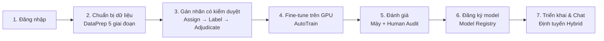
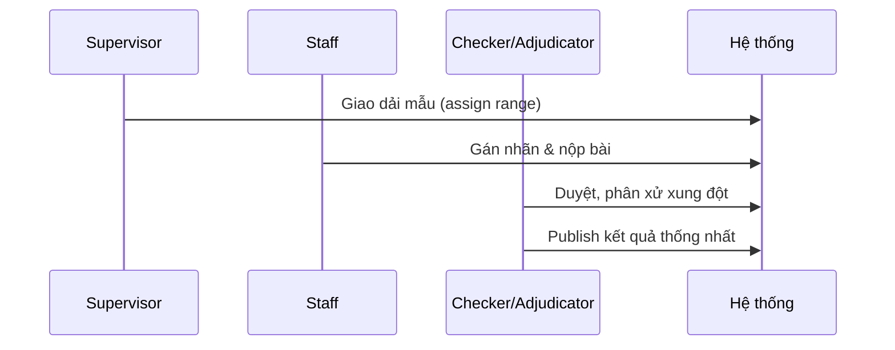
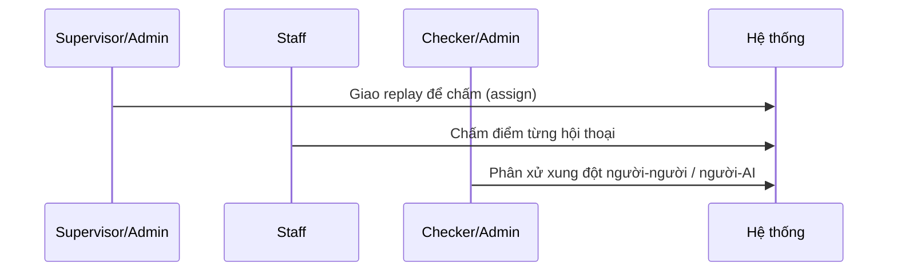

# Happy Case — Luồng nghiệp vụ chính (End-to-End)

> Tài liệu mô tả **kịch bản chạy thành công đúng thiết kế** của hệ thống SEP490 — nền
> tảng ML end-to-end để xây dựng **chatbot dạy học kiểu Socratic** (gợi mở tư duy
> thay vì trả lời thẳng). Dùng cho onboarding, viết test case, và nghiệm thu.

- **Phiên bản:** 1.0
- **Phạm vi:** Toàn bộ pipeline từ chuẩn bị dữ liệu → fine-tune → đánh giá → triển khai → chat.
- **Đối tượng đọc:** Dev, QA/Tester, Giảng viên hướng dẫn, thành viên nhóm.

---

## 1. Tổng quan sản phẩm

Hệ thống giúp một tổ chức giáo dục **tự xây dựng và vận hành chatbot gia sư** biết
đặt câu hỏi dẫn dắt (Socratic) theo từng môn học (Toán, Lý, Hóa, Sử, Anh…).

Kiến trúc gồm 4 service chạy trong Docker:

| Service | Cổng | Vai trò |
|---|---|---|
| Frontend (Nginx + React) | `80` | Giao diện người dùng |
| Backend (Node.js/Express) | `3000` (nội bộ) | API, RBAC, điều phối |
| GPU Service (Python/Flask) | `5000` (nội bộ) | Fine-tune & Inference LLM |
| MongoDB | `27017` (nội bộ) | Cơ sở dữ liệu |

Hệ thống phân **4 vai trò (RBAC)**:

- **Admin** — quản trị toàn hệ thống, người dùng, khóa API toàn cục.
- **Supervisor (Manager)** — điều phối pipeline, giao việc, huấn luyện, đánh giá.
- **Checker (Adjudicator)** — kiểm duyệt và phân xử chất lượng dữ liệu/đánh giá.
- **Staff** — thực thi: gán nhãn dữ liệu, chấm human-audit.

---

## 2. Happy Case tổng thể

Luồng thành công đi qua 7 chặng, theo đúng `workflowSteps` của trang giới thiệu:
**Prepare Data → Train → Evaluate → Register → Deploy/Chat.**

### Kết quả kỳ vọng cuối cùng
Người dùng cuối gửi câu hỏi trong màn Chat và nhận được **câu trả lời Socratic
đúng môn học**, phản hồi dạng streaming, được phục vụ bởi model đã fine-tune và
đánh giá đạt chuẩn.

---

## 3. Chi tiết từng chặng

### Chặng 1 — Đăng nhập
- **Người dùng:** mọi vai trò.
- **Hành động:** đăng nhập bằng email/mật khẩu (hoặc OAuth Google/Outlook).
- **API:** `POST /api/auth/login`
- **Điều kiện thành công:** tài khoản `status = active`, mật khẩu đúng → nhận **JWT** (hạn 7 ngày).
- **Kết quả:** token được đính kèm `Authorization: Bearer <token>` cho mọi request sau.

### Chặng 2 — Chuẩn bị dữ liệu (Data Preparation)
Màn `DataPrep` gồm **5 giai đoạn / 14 bước**:

| Giai đoạn | Nội dung | API chính |
|---|---|---|
| 1. Tải lên & Chuyển đổi | Upload `.json/.jsonl/.csv/.xlsx/.zip`, tự nhận định dạng | `POST /api/upload`, `POST /api/convert` |
| 2. Tiền xử lý | Làm sạch thẻ `<think>`, chuẩn hóa hội thoại | (xử lý phía client + convert) |
| 3. Gán nhãn (clustering) | Clean → Find K → K-means → gán nhãn cụm | `POST /api/cluster`, `POST /api/auto-label` |
| 4. Xem xét & Phân loại | Rà soát nhãn intent/action | `POST /api/cluster/filter`, `.../deduplicate` |
| 5. Hoàn tất | Xuất **dataset version** (train/validation/test + `_metadata.json`) | `POST /api/dataset-versions/create` |

- **Người dùng:** Supervisor/Admin (một số bước cần `requireManager`).
- **Kết quả:** một **Dataset Version** sạch, có truy vết (metadata + hash).

### Chặng 3 — Gán nhãn có kiểm duyệt (Human-in-the-loop)
Đây là luồng nhiều vai trò để tạo dữ liệu "vàng":

- **API:**
  - Giao việc: `POST /api/dataset-versions/:id/assignments/range` (`requireManager`)
  - Staff nộp: `POST /api/dataset-versions/:id/assignments/me/submit`
  - Duyệt/approve: `POST /api/dataset-versions/:id/assignments/users/:userId/approve`
  - Phân xử & publish: `POST /api/dataset-versions/:id/assignments/samples/:sampleId/adjudications/publish` (`requireAdjudicator`)
- **Kết quả:** dataset đã được con người thống nhất nhãn, sẵn sàng huấn luyện.

### Chặng 4 — Fine-tune trên GPU (AutoTrain)
- **Người dùng:** Supervisor/Admin (`requireManager`).
- **Hành động:** cấu hình job (LoRA/QLoRA, hyperparameter) và bắt đầu huấn luyện.
- **API:**
  - Bắt đầu: `POST /api/train/start` (upload ZIP dataset qua multipart)
  - Theo dõi log real-time (SSE): `GET /api/train/stream/:jobId`
  - Trạng thái: `GET /api/train/status/:jobId`
- **Luồng nội bộ:** Backend đẩy dataset sang **GPU Service (Flask)** kèm header
  xác thực `X-GPU-Token`; GPU Service chạy fine-tune và stream tiến độ về.
- **Kết quả:** job đạt trạng thái `COMPLETED`, sinh **model artifact** + lưu lịch sử huấn luyện.

### Chặng 5 — Đánh giá (Evaluation)
Gồm 2 lớp bổ trợ nhau:

**5a. Đánh giá tự động (Model Eval)**
- **API:** `POST /api/model-eval/run/:jobId` (upload eval file), stream `GET /api/model-eval/stream/:evalJobId`
- **Kết quả:** bộ metrics chuẩn hóa, có thể so sánh side-by-side, lên leaderboard (`/api/model-eval/leaderboard`).

**5b. Đánh giá bởi con người (Human Audit)**

- **API:** `GET /api/human-audit/my-assignments` (Staff), `PUT /api/human-audit/work/:evalId/review/:convIndex`,
  `POST /api/human-audit/manage/assign` (Manager), `POST /api/human-audit/manage/:evalId/adjudicate/:convIndex` (Adjudicator).
- **Kết quả:** điểm chất lượng cuối cùng, có xử lý bất đồng giữa người chấm.

### Chặng 6 — Đăng ký model (Model Registry)
- **Người dùng:** Supervisor/Admin.
- **Hành động:** version hóa model đạt chuẩn, đánh dấu trạng thái sẵn sàng dùng.
- **Màn hình:** `ModelRegistryView` (quản lý version, artifact, rollback).
- **Kết quả:** model có `ModelVersionStatus` hợp lệ để đưa vào phục vụ.

### Chặng 7 — Triển khai & Chat (Deploy / Inference)
- **Người dùng:** Supervisor/Admin nạp model; người dùng cuối chat.
- **API:**
  - Nạp model: `POST /api/model/load` (`requireManager`)
  - Định tuyến: `POST /api/router/decide` — chọn model chuyên môn theo môn học
  - Chat streaming: `POST /api/chat/stream` (hoặc `/api/infer/stream`)
- **Luồng nội bộ:** câu hỏi được **định tuyến hybrid** (`routerController` + `subjectModelRouter`)
  tới đúng model fine-tune theo môn, rồi trả lời dạng streaming.
- **Kết quả:** câu trả lời Socratic đúng môn, đúng ngữ cảnh, độ trễ thấp.

---

## 4. Happy Case rút gọn theo vai trò

| Vai trò | Luồng thành công điển hình |
|---|---|
| **Staff** | Nhận task được giao → gán nhãn / chấm human-audit → nộp → được duyệt |
| **Checker** | Xem hàng đợi review → phân xử xung đột → publish kết quả thống nhất |
| **Supervisor** | Chuẩn bị dataset → giao việc → chạy fine-tune → chạy đánh giá → đăng ký model |
| **Admin** | Toàn quyền pipeline + quản trị user (`/api/users`) + khóa API toàn cục (`/api/config/global-keys`) |
| **Người dùng cuối** | Vào Chat → hỏi → nhận trả lời Socratic đúng môn (streaming) |

---

## 5. Tiền đề để Happy Case chạy đúng

- **Phần cứng:** GPU NVIDIA ≥ 8GB VRAM, Docker, NVIDIA Container Toolkit.
- **Khởi động:** GPU Service cần ~1–2 phút để nạp model trước khi fine-tune/inference dùng được.
- **Biến môi trường bắt buộc** (đặt trong `.env`, không commit lên git):
  - `JWT_SECRET` — bí mật ký JWT (bắt buộc, không có sẽ không khởi động).
  - `ENCRYPTION_KEY` — mã hóa API key lưu trong DB (AES-256-GCM).
  - `MONGO_URI` — kết nối MongoDB.
  - `GPU_SERVICE_URL` — địa chỉ GPU service.
  - `GPU_SERVICE_TOKEN` — bí mật xác thực backend ↔ GPU service (`X-GPU-Token`).
  - `FRONTEND_ORIGINS` — danh sách origin cho CORS.
  - Khóa API các nhà cung cấp LLM (dùng cho đánh giá / định tuyến).
- **Truy cập:** người dùng chỉ vào **port 80**; backend/GPU/Mongo chỉ chạy nội bộ Docker network.

---

## 6. Tóm tắt một câu

> **Happy case** = người dùng đăng nhập → chuẩn bị & gán nhãn dataset đạt chuẩn →
> fine-tune model thành công trên GPU → đánh giá (máy + human audit) đạt →
> đăng ký model → chat nhận câu trả lời Socratic đúng môn qua định tuyến hybrid.

---

## 7. Tài liệu liên quan

- [`docs/HUONG_DAN_HE_THONG.md`](./HUONG_DAN_HE_THONG.md) — giới thiệu hệ thống, cấu hình, và hướng dẫn huấn luyện kèm ý nghĩa từng tham số.
- [`README.md`](../README.md) — hướng dẫn cài đặt & chạy hệ thống.
- [`docs/QUALITY_REVIEW_WORKFLOW.md`](./QUALITY_REVIEW_WORKFLOW.md) — quy trình kiểm duyệt chất lượng.
- [`docs/LOCKED_EVALUATION_GUIDE.md`](./LOCKED_EVALUATION_GUIDE.md) — chuẩn đánh giá khóa (locked eval).
- [`docs/MODEL_SWITCH_LATENCY_TEST_GUIDE.md`](./MODEL_SWITCH_LATENCY_TEST_GUIDE.md) — kiểm thử độ trễ chuyển model.
