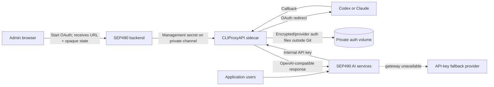

# OAuth AI Provider Gateway

## Objective

Allow the system to consume supported AI subscriptions through an isolated OAuth gateway while retaining the existing API-key providers as fallback. The web application must never receive or persist provider access/refresh tokens.

## Current scope

| Provider | Status | Notes |
|---|---|---|
| OpenAI Codex | POC implemented | Uses CLIProxyAPI `codex-auth-url` management flow |
| Claude Code | POC implemented | Uses CLIProxyAPI `anthropic-auth-url` management flow |
| Gemini | Disabled pending verification | Upstream exposes plugin infrastructure for `gemini-cli`, but the reviewed core does not expose a built-in `gemini-auth-url` route |
| Existing API-key providers | Preserved | OpenRouter/Gemini/Groq fallback remains available |

This POC uses **system-scoped accounts managed by Admin**. It does not claim per-user subscription isolation. CLIProxyAPI pools multiple accounts by default; personal account routing needs a separate design and must not be inferred from this POC.

## Architecture

## Security controls

- Sidecar and callback ports bind to `127.0.0.1` in the local POC. Docker bridge management traffic is accepted only with the separate Management secret.
- Image version is pinned to the reviewed `v7.2.47` release.
- Management and inference keys come from environment/config files excluded from Git.
- OAuth auth files live in a dedicated ignored volume.
- Only the `admin` role may start OAuth, list accounts, poll OAuth status, or disconnect accounts.
- Browser responses contain only provider, masked email, status, authorization URL and opaque state.
- Existing API keys are never returned to the browser after saving; settings endpoints expose only configured/not-configured state and accept updates for explicitly edited providers.
- Connection audit stores only actor, provider, action and a SHA-256 hash of state/account identifier.
- Disconnect uses an opaque account ID; the upstream auth filename is never returned to the browser.
- Gemini stays disabled until the plugin artifact, callback flow, token storage, license and provider terms are reviewed.

## Failure behavior

When `oauth_gateway` is explicitly selected, generation first calls CLIProxyAPI. On failure it falls back to the configured API-key provider (`openrouter` by default). A gateway-specific model ID is not forwarded to the fallback provider.

## Local demonstration

1. Copy `infra/cli-proxy/config.example.yaml` to the ignored `config.yaml`.
2. Generate separate random inference and management secrets.
3. Set the matching `CLIPROXY_*` variables in the ignored backend environment.
4. Start the optional compose profile.
5. Sign in as Admin and open **API Keys → OAuth Gateway**.
6. Connect Codex or Claude, complete provider login in the new browser window, and verify that the account appears with a masked email.
7. Run one AI action with provider `oauth_gateway`.
8. Stop the sidecar and repeat to demonstrate API-key fallback.
9. Disconnect the OAuth account and show the audit record in the database/log API.

## Production work still required

- TLS and a fixed public callback domain instead of localhost callbacks.
- Per-user account tenancy and deterministic routing if personal OAuth is required.
- Secret manager/KMS rather than plain environment variables.
- Provider terms/legal review and explicit user consent.
- Rate limit, quota visibility, token revocation and incident response.
- Pinned image digest and dependency vulnerability scanning.
