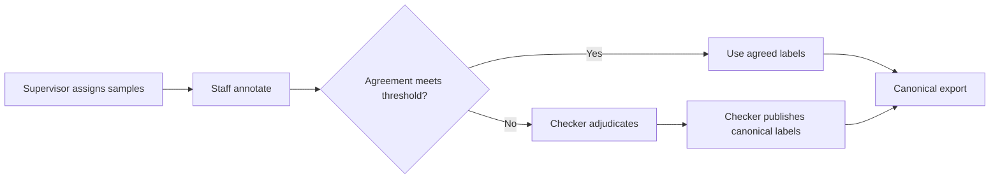
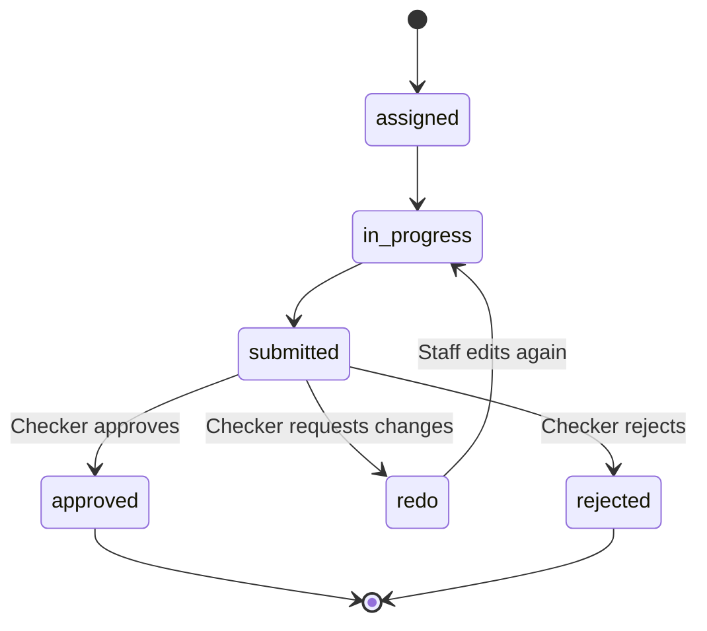

# Quality Review workflow

## Responsibility matrix

| Capability | Supervisor | Checker | Staff | Admin |
|---|---:|---:|---:|---:|
| Assign labeling/rewrite work | Yes | No | No | Yes |
| Configure overlap/conflict threshold | Yes | No | No | Yes |
| Label and rewrite samples | No | No | Yes | Emergency only |
| Resolve label conflicts | View only | Yes | No | Override |
| Approve/reject/redo rewrite | View only | Yes | No | Override |
| Connect system OAuth providers | No | No | No | Yes |
| View quality/audit status | Yes | Yes | Own work | Yes |

## Label review

`Chưa rõ` is a valid domain label chosen by an annotator. `Chưa chốt` is a workflow state shown while adjudication is pending. They must never be treated as the same value.

## Rewrite review

Supervisor tracks progress but does not approve content. Admin override is an exceptional path and must be audited.

## Audit events

- Label: `view`, `save_draft`, `publish`.
- Rewrite: `rewrite_approved`, `rewrite_redo`, `rewrite_rejected` with reason and before/after state.
- Provider: `oauth_started`, `oauth_succeeded`, `oauth_failed`, `account_disconnected` with hashed state/account identifiers.

## Demo sequence

1. Supervisor shows project filters and assigns Staff plus Checker.
2. Two Staff submit different labels beyond the threshold.
3. Checker opens the conflict-first comparison table and publishes a final label.
4. Quality evaluation creates a rewrite task.
5. Staff submits rewritten content.
6. Checker approves or requests redo; Supervisor sees the read-only status update.
7. Checker opens audit history and filters rewrite events.
8. Admin opens OAuth Gateway, shows token isolation/model status, then demonstrates API-key fallback with the gateway disabled.
