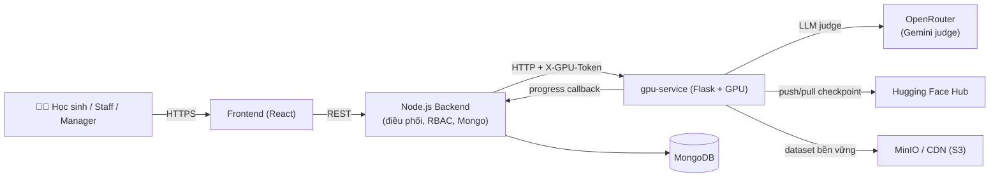
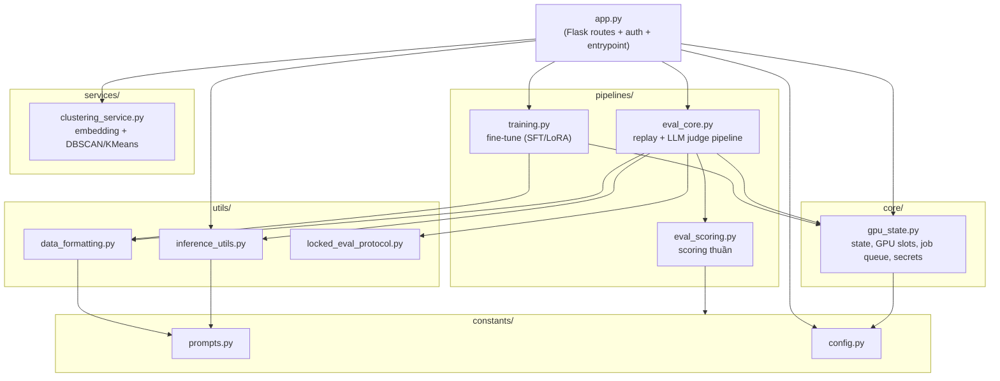
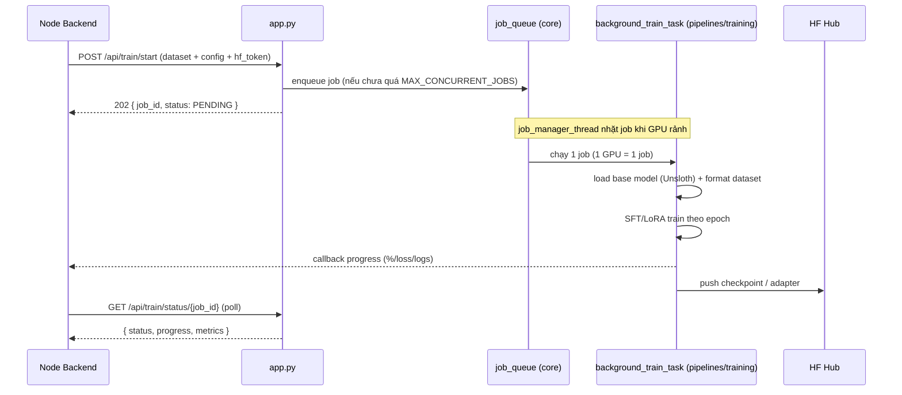
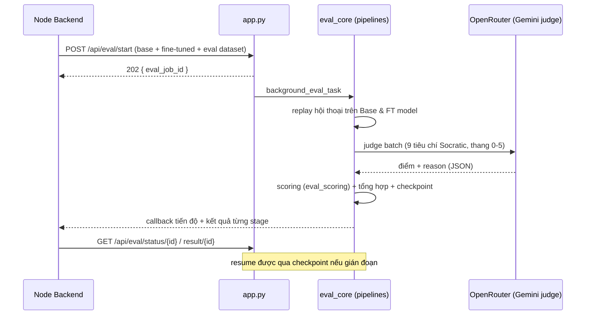
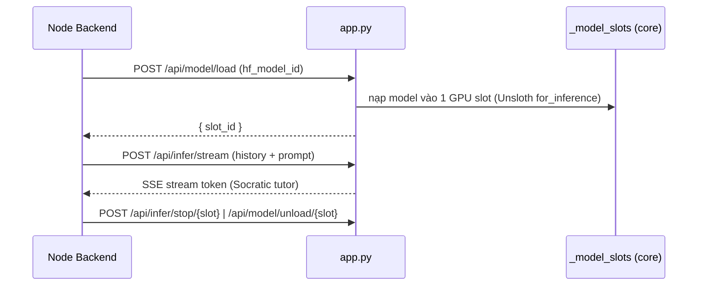
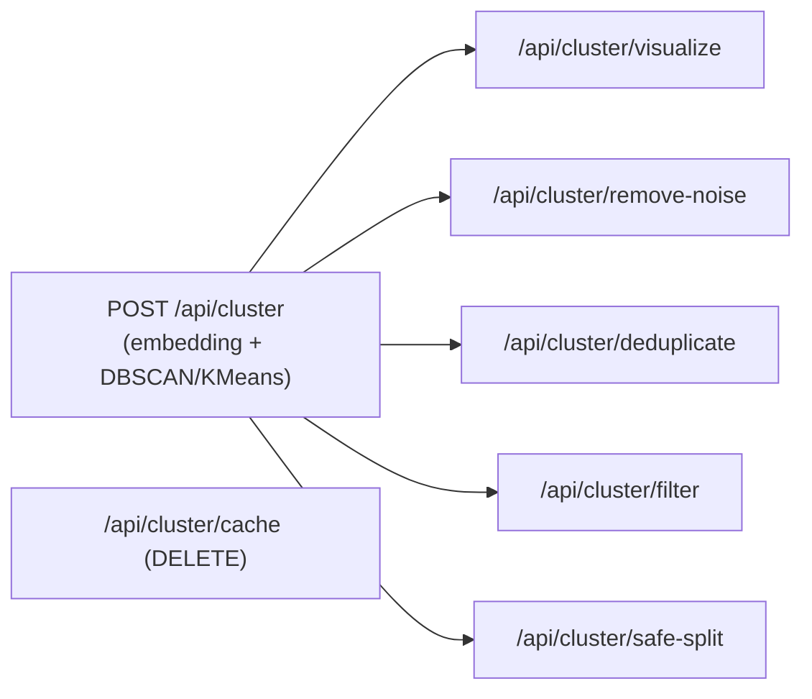
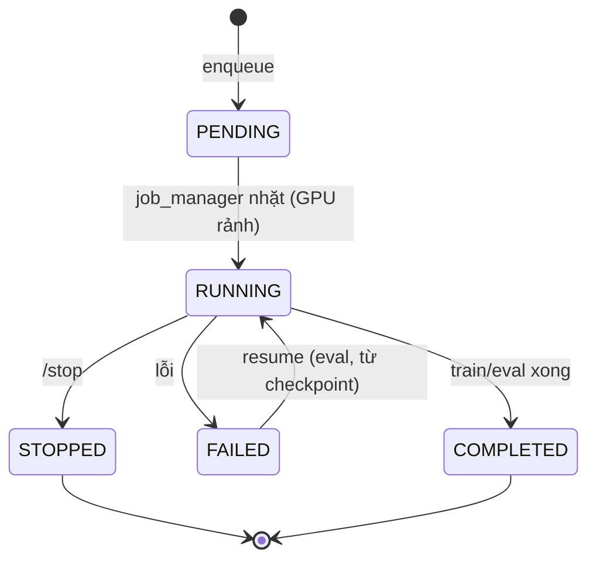

# GPU-Service — Business & Kiến trúc

> Tài liệu tổng quan nghiệp vụ + sơ đồ của **gpu-service** trong hệ thống SEP490
> (nền tảng gia sư Socratic / Flipped-Classroom). Cập nhật theo cấu trúc thư mục
> mới (`core / pipelines / services / utils / constants`).

---

## 1. gpu-service là gì? (Business context)

`gpu-service` là **backend tính toán GPU** của SEP490 — một Flask app chạy trên
máy có GPU (trước đây là Colab, nay self-hosted qua Docker). Nó gánh toàn bộ phần
việc nặng về máy học mà Node.js backend không làm được:

| Nghiệp vụ | Mô tả | Người dùng cuối |
|---|---|---|
| **AutoTrain** | Fine-tune model nền (Unsloth + LoRA/SFT) trên dataset Socratic | Staff/Manager tạo model chuyên môn |
| **Auto-Evaluation** | Chấm điểm Base vs Fine-tuned bằng LLM judge (9 tiêu chí Socratic) | Manager/Adjudicator duyệt chất lượng |
| **Inference/Serving** | Nạp model đã train vào GPU slot & stream chat (SSE) | Học sinh chat với gia sư AI |
| **DataPrep Clustering** | Embedding + DBSCAN/KMeans để lọc/dedup/split dataset | Staff chuẩn bị dữ liệu |

**Vị trí trong hệ thống:** Frontend gọi Node.js backend; backend điều phối và
gọi sang gpu-service qua HTTP (bảo vệ bằng shared token). gpu-service **không** nói
chuyện trực tiếp với frontend.

---

## 2. Kiến trúc module (sau khi gom thư mục)

**Nguyên tắc phụ thuộc:** `constants/` là dữ liệu thuần (không import ai);
`core/` là nền tảng; `pipelines/`, `services/`, `utils/` dùng chung `core` +
`constants`; `app.py` là lớp route ngoài cùng. Không có phụ thuộc vòng.

---

## 3. Các luồng nghiệp vụ chính

### 3.1 AutoTrain (fine-tuning)

Endpoint liên quan: `POST /api/train/start`, `GET /api/train/status/<id>`,
`GET /api/train/checkpoint/<id>`, `GET /api/train/queue-status`,
`POST /api/train/stop/<id>`.

### 3.2 Auto-Evaluation (LLM judge)

Điểm nhấn: có **checkpoint** để `POST /api/eval/resume/<id>` nếu job gián đoạn;
`locked_eval_protocol` giữ giao thức so sánh Base-vs-FT bất biến (paired stats,
bootstrap). Endpoint: `POST /api/eval/start`, `/resume/<id>`, `GET /status/<id>`,
`GET /active`, `DELETE /checkpoint/<id>`, `GET /result/<id>`.

### 3.3 Inference / Chat serving

Endpoint: `POST /api/model/load`, `GET /api/model/status`,
`POST /api/model/unload/<slot>`, `POST /api/infer/stream`,
`POST /api/infer/stop/<slot>`, `GET /api/infer/logs[/<id>]`.

### 3.4 DataPrep Clustering

`services/clustering_service.py` (singleton `_service`) tạo embedding bằng
SentenceTransformer rồi gom cụm để Staff lọc nhiễu, khử trùng lặp và chia
train/eval an toàn (tránh rò rỉ giữa các tập).

---

## 4. Trạng thái & đồng thời (GPU)

- **Train:** `MAX_CONCURRENT_JOBS = 1` (1 GPU chạy 1 job train tại 1 thời điểm),
  điều phối bởi `job_manager_thread` + `job_queue`.
- **Eval:** tối đa `GPU_EVAL_SLOTS = 3` slot đồng thời (semaphore).
- **Inference:** nhiều `_model_slots` cho phép giữ sẵn model đã nạp để chat.
- **Checkpoint:** lưu ở `/tmp/checkpoints_` (ephemeral) + dataset đẩy lên
  MinIO/CDN (bền vững qua restart).

---

## 5. Bảo mật & vận hành

- **Shared-secret auth:** khi đặt `GPU_SERVICE_TOKEN`, mọi request phải kèm header
  `X-GPU-Token`. `/health` và CORS preflight được miễn để probe vẫn chạy. Không
  đặt token = no-op (chỉ dùng cho local dev), **bắt buộc đặt** ở môi trường expose.
- **Giới hạn VRAM:** `GPU_MEMORY_FRACTION` (vd `0.2`) giới hạn % VRAM để chạy chung
  server với dịch vụ khác.
- **Deploy:** `Dockerfile` (PyTorch CUDA 12.1 + Unsloth), chạy qua
  `docker-compose.prod.yml` với `deploy.resources.reservations` cho NVIDIA GPU.
  `app.py` là entrypoint (`CMD ["python", "app.py"]`).

---

## 6. Bảng API tóm tắt

| Nhóm | Endpoint | Method |
|---|---|---|
| Health | `/health` | GET |
| Train | `/api/train/start` · `/status/<id>` · `/checkpoint/<id>` · `/queue-status` · `/stop/<id>` | POST/GET |
| Eval | `/api/eval/start` · `/resume/<id>` · `/status/<id>` · `/active` · `/checkpoint/<id>` · `/result/<id>` | POST/GET/DELETE |
| Inference | `/api/model/load` · `/model/status` · `/model/unload/<slot>` · `/infer/stream` · `/infer/stop/<slot>` · `/infer/logs[/<id>]` | POST/GET |
| DataPrep | `/api/cluster` · `/filter` · `/remove-noise` · `/deduplicate` · `/visualize` · `/safe-split` · `/cache` | POST/DELETE |
| System | `/api/system/resources` · `/api/system-eval/resources` | GET |
